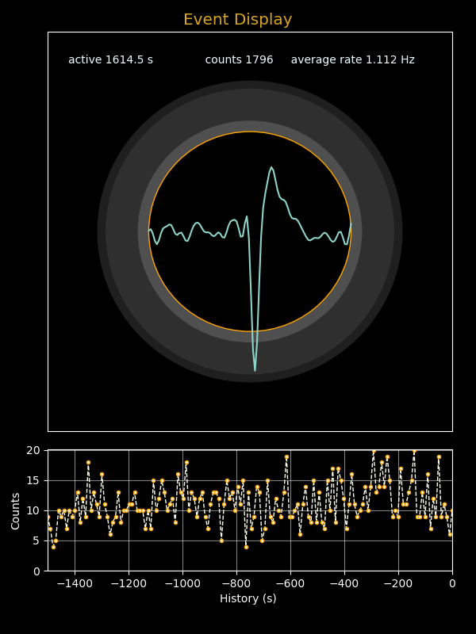

## *PhyPiDAQ*: Datenaufname do-it-yourself Teilchendetektor

Übersetzt aus der englischen Version mit Hilfe von DeepL.com (kostenlose Version)

Der Nachweis von Radioaktivität, die entweder durch künstliche Quellen oder als Teil der
 natürlichen Umwelt entsteht, wie K-40 oder Radon aus dem Erdinneren, ist ein faszinierendes Forschungsgebiet, das heute mit preiswerten und einfachen Detektoren zugänglich geworden ist. 
 Es gibt kommerzielle Angebote, aber auch eine Reihe von Vorschlägen für Do-it-yourself-Projekte. 
 Die Soundkarte eines Standard-PCs ist geeignet, die Signale aufzuzeichnen, die dann mit einem 
 beliebigen Soundkarten-Oszilloskop visualisiert werden können. 


### Der CERN DIY Teilchendetektor  

Ein relativ neuer Vorschlag für einen einfachen, kostengünstig  und leicht zu bauenden Teilchendetektor basierend auf vier Silizium  PIN-Photodioden vom Typ BPW34 ist der 
[CERN DIY_particle_detector](https://github.com/ozel/DIY_particle_detector). 
Der zweistufige Verstärker mit einem Operationsvertärker mit hoher Bandbreite erzeugt große
Signale von mehreren Hundert mV mit einer Breite von etwa 100 µs. Solche Signale können leicht mit einer Soundkarte aufgenommen werden. 

Die Verfügbarkeit der erforderlichen Bauteile, einschließlich der Leiterplatine, und die großen und langen Signale machen diesen Detektor zu einer idealen Wahl für Projekte mit Oberstufenschülern. Neben dem Bau des Geräts werden Erfahrungen in der Datenerfassung gewonnen und die Analyse eines faszinierenden Phänomens ermöglicht, das nicht direkt mit den menschlichen Sinnen erfassbar ist. 


### Datenerfassung und Auswertung mit *PhyPiDAQ*

*PhyPiDAQ* enthält mehrere Module zur Aufzeichnung, Visualisierung und Analyse von Daten. 
Ein in diesem KOntext interessanter und wichtiger Aspekt ist die Zufälligkeit des Auftretens der Signal von Teilchen im Detektor. Da die Wahrscheinlichkeit für das Auftreten eines Signals zeitlich konstant ist, wird die Anzahl der in einem bestimmten Zeitintervall beobachteten Ereignisse durch die Poisson-Statistik beschrieben. Charakteristisch für einen solchen Prozess ist außerdem, dass die Zeit zwischen den
zufällig auftretenden Ereignissen einer Exponentialverteilung folgt.

Der exponentielle Zerfall einer Probe von radioaktiven Kernen ist ein weiterer wichtiger Aspekt, der untersucht werden kann, 
wenn eine Probe von kurzlebigen Kernen zur Verfügung gestellt werden kann. In der Natur ist eine solche Quelle die aus dem Erdinneren als Folge radioaktiver Prozesse austretenden Isotope des Edelgases Radon, dessen Zerfallsprodukte auf einem elektrisch geladenen Luftballon akkumuliert werden können.

Relevante Module des *PhyPiDAQ*-Pakets sind:

  - `phypidaq\soundcardOsci` mit zwei Klassen zur Aufzeichnung, Auswahl und Anzeige von Wellenformen von einer
  PC-Soundkarte, 

  - phypidaq/DisplayPoissonEvent", eine Klasse zur Anzeige einzelner Ereignisses  eines Poisson-Prozesses. 

Gebrauchsfertige Skripte veranschaulichen die Verwendung dieser Klassen: 

  - `examples/oscilloscope/run_scOsci.py`, um von einer Soundkarte ausgelesene Wellenforan anzuzeigen.  

  - `examples/scGammaDetector.py` zur Visualisierung jedes Auftretens eines großen Signals und der
  zugehörigen Wellenformdaten um den Auslösepunkt herum. Außerdem wird eine Ratenhistorie angezeigt. 
  Das Skript bietet auch die die Möglichkeit, die Ereigniszeiten und Signalhöhen für eine Offline-Analyse
  in einer Datei zu speichern. Es ist auch möglich, nur eine Teilmenge der auslösenden Impulse zu visualisieren, wenn die
  Ereignisrate sehr hoch ist. 
    
  Untersuchungen von Poisson-Prozessen ermöglichen die Python-Skripte 
 
  - `examples/poissonFlash.py` zur Erzeugung, Visualisierung und Speicherung von Daten eines simulierten
  Poisson-Prozesses. 

  - `examples/poissonLED.py` zur Erzeugung zufälliger Blitze einer LED. Eine Photodiode, die dem Licht der der LED ausgesetzt ist, erzeugt Signale, die einem Detektor für Gammastrahlen entsprechen.

 Eine typische Wellenform, die mit *python3 scGammaDetector.py -o* aufgezeichnet wurde, ist in der folgenden Abbildung dargestellt. Das Signal ist  oberhalb des Rauschpegels von ca. 3500 ADC-Counts deutlich sichtbar. Es ist groß genug, um direkt an einen Kopfhörer angeschlossen zu werden, so dass die Signalklicks auch akustisch wahrgenommen werden können. 
 
  

Das Skript bietet eine Reihe von Befehlszeilenoptionen, um die visuelle Ausgabe zu steuern und die Speicherung der Ergebnisse in einer Datei zu ermöglichen, oder um die Parameter der Soundkarte und die Triggeroptionen einzustellen. Die Ausgabe des Befehls `./scGammaDetector -h` gibt einen Überblick über alle Optionen: 

```
usage: scGammaDetector.py [-h] [-q] [-o] [-n] [-f FILE] [-t TIME] [-s {48000,96000,192000,44100}] [-c {1,2}] [-l TRGLEVEL] [--trgfalling] [-d] [-z SAMPLESIZE] [-r RANGE] [-i INTERVAL]

Read waveforms from soundcard and display and optionally store data

options:
  -h, --help            show this help message and exit
  -q, --quiet           no status output to terminal
  -o, --oscilloscope    oscilloscope display
  -n, --noeventdisplay  deactivate event display
  -f FILE, --file FILE  base filename to store results
  -t TIME, --time TIME  run time in seconds
  -s {48000,96000,192000,44100}, --samplingrate {48000,96000,192000,44100}
                        sampling rate
  -c {1,2}, --channels {1,2}
                        number of channels
  -l TRGLEVEL, --trglevel TRGLEVEL
                        level of trigger
  --trgfalling          trigger falling edge
  -d, --trgdeactivate   deactivate triggering
  -z SAMPLESIZE, --samplesize SAMPLESIZE
                        number of samples per read
  -r RANGE, --range RANGE
                        display range
  -i INTERVAL, --interval INTERVAL
                        time bin for rate display
```

Angemessene Standardeinstellungen sorgen dafür, dass in den meisten Fällen eine brauchbare Ausgabe erzeugt wird. Da die Signalrate  in normalen Umgebungen ohne radioaktive Quelle sehr gering ist, sollte die Triggerschwelle knapp über dem Rauschpegel eingestellt werden, so dass einige Rauschimpulse sichtbar werden.
Es ist auch ratsam, die Option `-o` zu verwenden, um die Oszilloskopansicht einzuschalten. 
Beachten Sie, dass der Signalpegel von den Einstellungen der Soundkarte abhängt. Verwenden Sie zur Auswahl des Standard-Eingabegeräts das entsprechende Werkzeug  Ihres PC-Betriebssystems, insbesondere auch um die Lautstärke einzustellen.  

Um sich mit der Software vertraut zu machen, insbesondere mit der Auswahl der Daten durch Einstellung geeigneter Triggerbedingungen, ist es nützlich, ein Mikrofonsignal als Eingangsquelle zu verwenden. Zunächst wird nur das Oszilloskop  mit einem sehr niedrigen Triggerpegel gestartet:     
   > `python3 scGammaDetector.py -n -o -l 100`
        
Damit werden die Rohdaten der Soundkarte auf dem Oszilloskop-Display angezeigt. Erzeugen Sie nun
ein lautes Geräusch, z.B. indem Sie in die Hände klatschen oder mit den Fingern schnipsen, und Sie werden einige kurze Signale sehen, die weit über dem durchschnittlichen Geräuschpegel liegen. Merken  Sie sich den typischen Signalpegel des Untergrundrauschens.  
Beenden Sie das Programm nun durch Eingabe von "E" in der Befehlszeile oder durch Klicken auf die Schaltfläche "End" in der grafischen Benutzeroberfläche. Starten Sie es dann erneut mit einem höheren Triggerpegel, wobei Sie diesmal die Ereignisanzeige aktiviert lassen:  
   > `python3 scGammaDetector.py -l 1500`  
Sie sollten keine Signale sehen - es sei denn, Sie erzeugen ein lautes Geräusch, dessen Verlauf dann in der Ereignisanzeige angezeigt wird.  
*Anmerkung*: die gleichzeitige animierte Anzeige von Ereignisdarstellung und Oszillogramm funktioniert unter MS Windows nicht stabil; unter Linux können problemlos beide Anzeigen aktiviert werden:  `python3 scGammaDetector.py -o -l 1500`

Das Aufspüren der sehr kleinen Signale des DIY-Teilchendetektors des CERN funktioniert auf genau
dieselbe Weise. Verbinden Sie den Ausgang des Detektors mit dem Mikrofoneingang Ihrer Soundkarte und wiederholen Sie das eben beschriebene Verfahren, um den richtigen Triggerpegel zur Unterscheidung der echten Signalen nachgewiesener Teilchenvom Untergrundrauschen zu trennen. Beachten Sie, dass der Signalpegel von den Einstellungen Ihrer Soundkarte abhängt, vor allem von der Lautstärke. Wenn möglich, erhöhen Sie die Abtastrate auf den höchstmöglichen Wert, der von Ihrer Soundkarte unterstützt wird - typische Werte sind 44100, 48000, 96000 oder 192000 Samples/s. Ziehen Sie auch in Betracht, die Samplegröße einer einzelnen Aufnahme mit der Option `-z<n>` anzupassen - 256 oder 512 sind optimale Einstellungen für die kurzen Pulse des Teilchendetektors, aber einige Soundkartentreiber unterstützen nur eine minimalen Wert von 1024. Wenn die Samplegröße zu groß ist, könnten mehr als ein Signal in dem Sample enthalten sein, aber nur das erste würde gezählt.   

Es ist offensichtlich, dass der Triggerpegel einen starken Einfluss auf die aufgezeichnete Signalrate hat. Ist er zu niedrig, wird der größte Teil der echten Signale erfasst, aber es sind auch viele Rauschimpulse vorhanden. Ist der Triggerpegel zu hoch, werden die meisten Rauschimpulse unterdrückt, aber es gehen auch Signalimpulse verloren. Hier gibt es keinen Ausweg - die Nachweiseffizienz und die Untergrundunterdrückung können nicht beide 100 % betragen!
Wenn eine absolute Rate bestimmt werden soll, müssen Korrekturen für die schwellenabhängige Signaleffizienz und Untergrundkontamination vorgenommen werden.  

Die nachstehende Abbildung zeigt die Ausgabe des Teilchendetektors unter Messbedingungen bei niedrigen Raten. Ein blinkender Kreis zeigt das Auftreten eines ausgelösten Ereignisses an, und die entsprechende (normalisierte) Wellenform mit 100 Abtastpunkten um den Auslösezeitpunkt herum wird ebenfalls angezeigt. Es wird auch ein Ratenverlauf angezeigt; die Bin-Breite in Sekunden kann mit der Option `--interval <n>` eingestellt werden. 



Die Bestimmung des Untergrundniveaus und der Signaleffizienz mit kleinen Unsicherheiten ist nicht immer leicht zu bewerkstelligen. Der Untergrund kann durch Messungen ohne die Signalquelle recht genau bestimmt werden. Die Bestimmung der Signaleffizienz hingegen erfordert genaue Kenntnis des Detektors und der Signaleigenschaften, die in der Regel durch eine detaillierte Modellierung der physikalischen Prozesse im Detektor und des Ansprechverhaltens  der Front-End-Elektronik gewonnen werden. Für den Fall, dass derartige Untersuchungen von Signal-Effizienz vs. Reinheit von Interesse sind, können die mit `scGammaDetector.py -f <name>` in eine Datei `<name>_time.csv` aufgezeichneten Daten analysiert werden, um weitere Erkenntnisse zu gewinnen. Die Aufzeichnung von detektierten Impulsen wird mit der Option `-f <Dateiname>` eingeschaltet; für jedes detektierte Signal werden die "Ereignisnummer", die Zeit des Auftretens in Sekunden seit Programmstart und die Impulshöhe in ADC-Counts in der Datei gespeichert. In einer Offline-Analyse kann ein Impulshöhenspektrum, d. h. die Häufigkeit des Auftretens von Impulshöhen in einem bestimmten Intervall, aus den aufgezeichneten Daten abgeleitet werden, die mit einer niedrigen Triggerschwelle aufgenommen wurden. Dieses Spektrum zeigt eine große Anzahl von sehr kleinen Impulsen, aber auch eine deutliche Anhäufung von echten Signalen bei höheren Werten. Aus Daten, die ohne Teilchenquelle aufgenommen wurden, kann ein Spektrum der erwarteten Untergrundsignale bestimmt und von den Daten, die mit einer Signalquelle aufgenommen wurden, abgezogen werden.  


### Ergebnisse

Die Analyse von mit `scGammaDetector.py` aufgezeichnten Gammaquanten aus einer kleinen Probe Pechblende ist in der nachstehenden Abbildung gezeigt. Signalpulse wurden mit einer Rate von ca. 1,32 HZ registriert. Die Datei
`GammaStrahlung_Pechblende.csv` enthält ca. 11500 aufgezeichnete Ereignisse mit den Spalten  
  > `event_numer, event_time[s], pulse_height[adc]`

Ausgewertet wurde nur die mittlere Spalte mit den Zeiten, zu denen Ereignisse registriert wurden. Dazu wurde der Python-Code `data/RateAnalysis.py` mit der Eingabe  
 > `python3 RateAnalyis.py GammaStrahlung_Pechblende.csv 10` 
 
 verwendet. Der letzte Parameter legt die Dauer der Zeitinvervalle (in s) fest, in denen
 jeweils die Ereignisanzahlen ermittelt werden. 

Die Grafiken zeigen die Zahl der Ereignisse in Intervallen von 10 s Dauer, die Häufigkeitsverteilung der beobachteten Ereignisanzahlen und die Zeit zwischen zwei Ereignissen.
Die sich aus der mittleren Rate ergebenden erwarteten Verteilungen
sind ebenfalls eingezeichnet, d.h. eine Gleichverteilung für eine mittlere Ereignisanzahl 
von 13.2 in jedem 10 s-Intervall, die entprechende Poisson-Verteilung und eine 
Exponentialverteilung für einen mittleren zeitlichen Abstand von 1/1.32 s = 0.757 s zwischen den Ereignissen sind ebenfalls eingezeichnet. 


      mehr muss noch gemacht und aufgeschrieben werden ...
  
